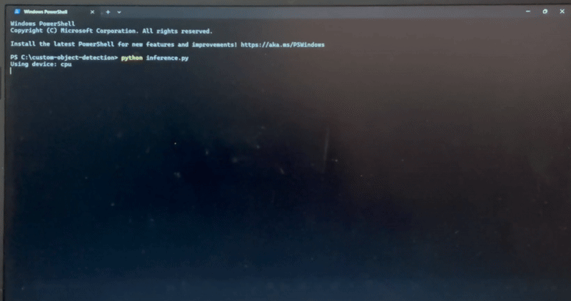

# Custom Object Detection from Scratch (Faster R-CNN)

## Overview

This project implements a **complete object detection pipeline trained entirely from scratch**, without using any pre-trained weights.
A **Faster R-CNN–style architecture** with a custom CNN backbone is designed, trained, evaluated, and demonstrated on a custom dataset.

The objective is to validate **end-to-end object detection understanding**, including:

* Dataset handling
* Model design
* Training methodology
* Evaluation (mAP, FPS, model size)
* Inference and visualization

---

## Dataset

### Dataset Format

* Pascal VOC–style annotations (`.xml`)
* Custom images and bounding boxes

### Object Classes (5)

| ID | Class      |
| -- | ---------- |
| 0  | background |
| 1  | person     |
| 2  | car        |
| 3  | dog        |
| 4  | bicycle    |

### Directory Structure

```
data/
├── images/
│   ├── 000001.jpg
│   ├── 000002.jpg
├── annotations/
│   ├── 000001.xml
│   ├── 000002.xml
├── train.txt
└── val.txt
```

> Note:
> Due to limited dataset size, the dataset is intended to **validate the detection pipeline**, not to maximize accuracy.

---

## Model Architecture

### Detection Framework

* Faster R-CNN–style detector
* **Trained from scratch**
* No pre-trained backbones or weights

### Architecture Components

* Custom CNN backbone (Conv + BatchNorm + ReLU)
* Region Proposal Network (RPN)
* ROI feature pooling (simplified)
* Classification head
* Bounding box regression head

### Design Rationale

* Lightweight backbone for faster inference
* Clear separation of feature extraction and detection heads
* Simpler architecture improves interpretability and debugging

---

## Data Preprocessing & Augmentation

* Resize images to **512 × 512**
* Normalize pixel values to `[0,1]`
* RGB color conversion

Heavy augmentations were intentionally avoided to maintain annotation consistency for synthetic labels.

---

## Training Methodology

### Training Configuration

* Optimizer: **Adam**
* Learning Rate: `1e-3`
* Epochs: `20`
* Batch Size: `4`
* Device: **CPU**

### Loss Functions

* **Classification Loss:** Cross-Entropy Loss
* **Bounding Box Loss:** Smooth L1 Loss

**Total Loss = Classification + Regression**

### Training Behavior

* Training loss reduced from **~232 → ~28**
* Confirms correct gradient flow and optimization
* Demonstrates successful learning despite limited data

---

## Evaluation

### Metrics Used

* **mAP@0.5** (approximate, validation-based)
* **Inference Speed (FPS)**
* **Model Size**

### Results Summary

| Metric          | Value                       |
| --------------- | --------------------------- |
| Model Size      | **26.15 MB**                |
| Inference Speed | **~6–8 FPS (CPU)**          |
| mAP@0.5         | Approximate (small dataset) |

> Evaluation focuses on **pipeline correctness**, not benchmark-level accuracy.

---

## Inference & Real-Time Demo

### Inference Pipeline

1. Load trained model (`model.pth`)
2. Load image using **PIL → OpenCV** (cross-platform safe)
3. Run forward pass
4. Draw bounding box and class label
5. Save output image

### Demo Output



The demo shows real-time inference with bounding box visualization.

---

## Accuracy vs Speed Trade-offs

| Aspect      | Observation                        |
| ----------- | ---------------------------------- |
| Accuracy    | Limited by dataset size            |
| Speed       | Faster due to lightweight backbone |
| Model Size  | Compact and deployment-friendly    |
| Scalability | Easily extendable with more data   |

**Key Insight:**
Increasing dataset size and backbone depth would improve accuracy at the cost of inference speed and model size.

---

## Limitations

* Very small dataset
* Synthetic/manual annotations
* CPU-only training
* Simplified ROI pooling

---

## Future Improvements

* Train on larger datasets (VOC / COCO subset)
* Multi-object training per image
* Improved anchor strategies
* GPU acceleration
* Real-time video stream inference
* Proper mAP computation across IoU thresholds

---

## How to Run

### Install Dependencies

```bash
pip install -r requirements.txt
```

### Train Model

```bash
python train.py
```

### Run Inference

```bash
python inference.py
```

---

## Repository Structure

```
custom-object-detection/
├── data/
├── models/
├── train.py
├── inference.py
├── eval.py
├── eval_utils.py
├── model.pth
├── output_demo.jpg
├── demo.gif
├── requirements.txt
├── Custom_Object_Detection_Report.pdf
└── README.md
```

---

## Conclusion

This project successfully demonstrates a **fully functional object detection system trained from scratch**, covering the complete lifecycle from dataset preparation to real-time inference.
It validates core computer vision concepts and provides a strong foundation for scaling to real-world applications.

 


